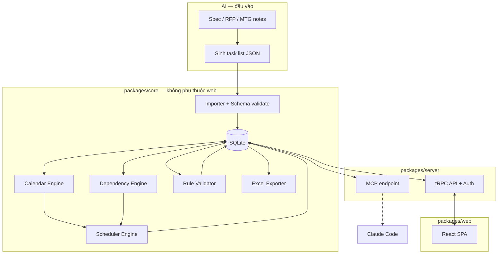
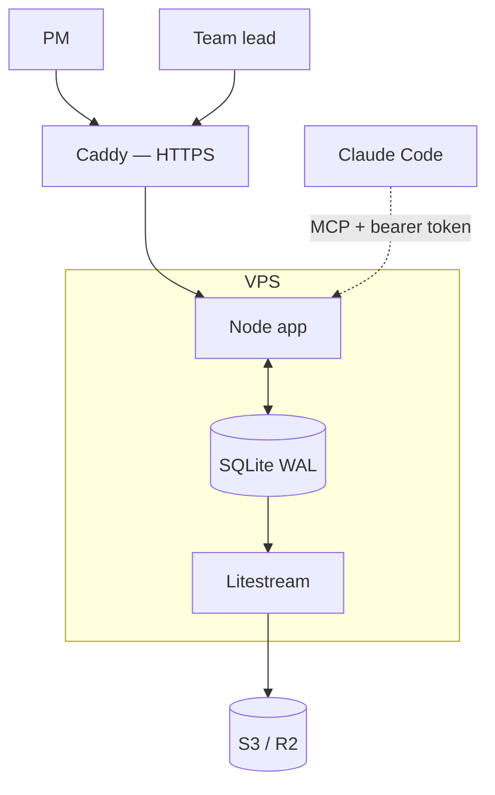
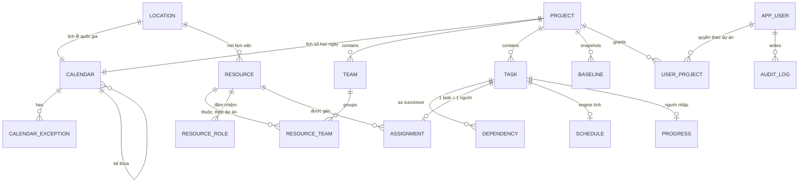
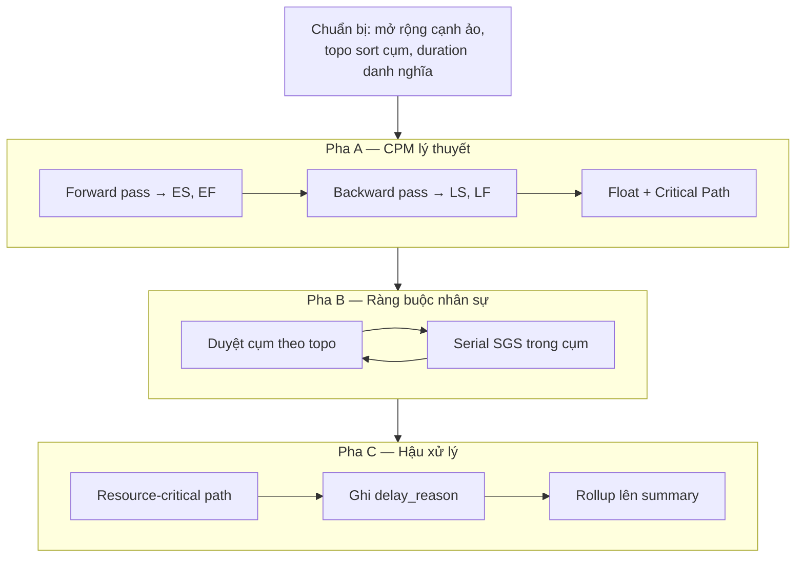
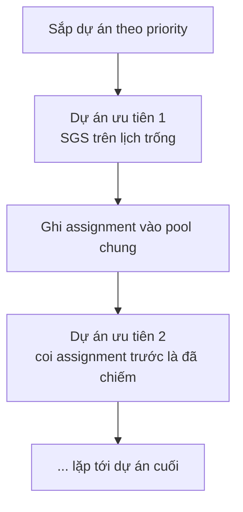
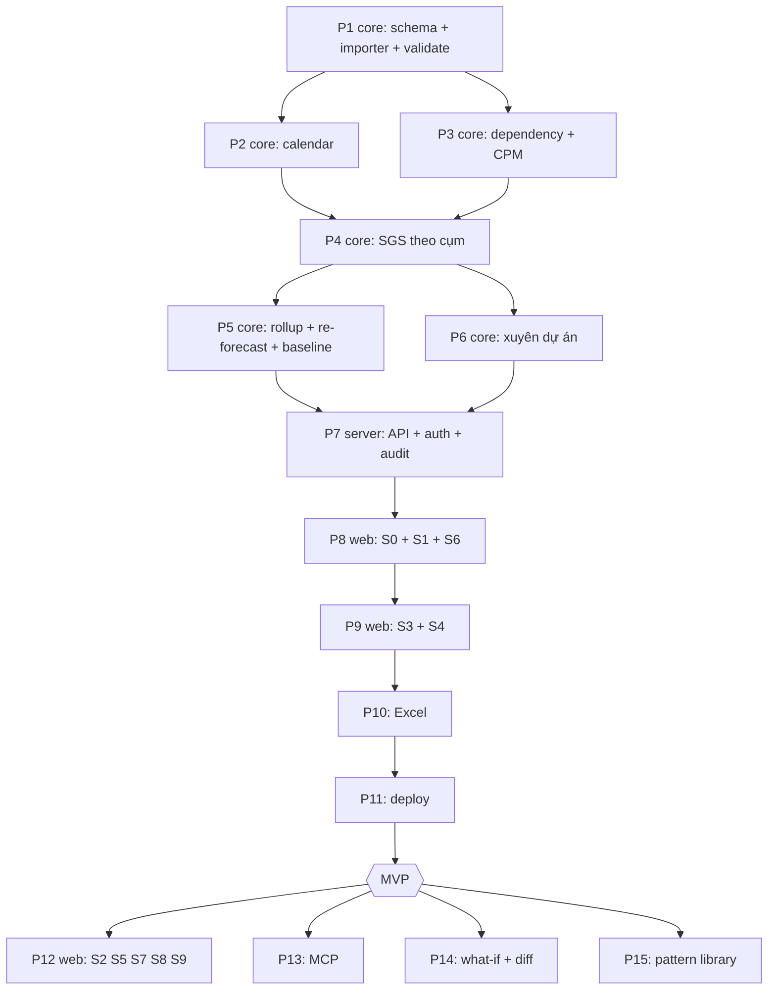

# WBS Tool — Specification v1.0

Công cụ Planning & Control cho PM thị trường Nhật. Nhận task list do AI sinh,
tính lịch tự động theo ràng buộc nhân sự và lịch làm việc, theo dõi tiến độ,
xuất báo cáo Excel cho stakeholder.

**Trạng thái:** chốt để triển khai. Mọi quyết định thiết kế ở Phụ lục A.

---

## 1. Mục tiêu và phạm vi

### 1.1. Mục tiêu

| ID | Mục tiêu | Đo bằng |
|---|---|---|
| M1 | Mọi số liệu đều do engine tính, không do người gõ | 100% trường ngày/người trong báo cáo đến từ bảng `schedule`/`assignment` |
| M2 | Kết quả tái lập được | Cùng input → cùng output, byte-for-byte |
| M3 | Chặn lỗi trước khi lộ ra với khách | Validate bắt được vòng lặp, thiếu role, overallocate, mâu thuẫn tổng/chi tiết |
| M4 | Team lead chịu dùng | Dưới 30 phút nhập tiến độ mỗi tuần |

### 1.2. Trong phạm vi

- Quản lý cây WBS qua giao diện web.
- Import task list có cấu trúc do AI sinh.
- Tính lịch: CPM + ràng buộc nhân sự + lịch làm việc, **xuyên nhiều dự án**.
- Nhập và theo dõi tiến độ thực tế.
- Chốt số liệu và baseline có chủ đích.
- Xuất báo cáo Excel — một chiều.
- Lớp MCP để AI truy vấn.

### 1.3. Ngoài phạm vi

- **Không** làm lớp Execution: ticket, comment, board, log work, notification. Đó là việc của Jira.
- **Không** đồng bộ Jira. Hai hệ chạy song song. Khi lệch nhau, **tool là nguồn đúng**.
- **Không** cho dev truy cập.
- **Không** nhập ngược từ Excel.
- **Không** đuổi theo lịch tối ưu. RCPSP là NP-hard. Mục tiêu là lịch hợp lý và giải thích được.

### 1.4. Người dùng

| Vai trò | Số lượng | Phạm vi |
|---|---|---|
| Admin | 1 | Toàn hệ thống: tạo dự án, quản lý nhân sự và lịch |
| PM | 1–2 | Toàn quyền trong dự án được gán |
| Team lead | 3–6 | Nhập tiến độ cho task của team mình, trong dự án được gán |

Quy mô ban đầu: 2 dự án, khoảng 8 người dùng.

### 1.5. Quy mô dữ liệu

| Chỉ số | Giá trị thiết kế |
|---|---|
| Task mỗi dự án | tới 6.000 |
| Độ mịn task lá | 0.25 MD |
| Độ sâu cây | tới 6 cấp |
| Nhân sự | 15–30 người |
| Khung thời gian | 400 ngày làm việc |
| Dự án song song | 2–5 |

---

## 2. Nguyên tắc bất biến

Năm nguyên tắc dưới đây không được vi phạm ở bất kỳ phần nào của hệ thống.

**N1 — AI chỉ đứng ở hai đầu.**

| Việc | AI | Engine |
|---|---|---|
| Sinh tên task, phân rã công việc | ✅ | ❌ |
| Đề xuất effort MD | ✅ | ❌ |
| Đề xuất quan hệ phụ thuộc | ✅ | ❌ |
| Tính ngày bắt đầu / kết thúc | ❌ | ✅ |
| Gán người thực hiện | ❌ | ✅ |
| Tính critical path, float | ❌ | ✅ |
| Kiểm tra mâu thuẫn | ❌ | ✅ |
| Định dạng và diễn giải output | ✅ | ❌ |

AI chỉ ghi vào DB qua importer có schema. Không bao giờ ghi trực tiếp vào `schedule` hay `assignment`.

**N2 — Deterministic.** Mọi thuật toán phải có tie-break cố định. Cấm `random`,
`Date.now()`, thứ tự duyệt của `Object.keys()`, hay bất kỳ thứ gì phụ thuộc môi trường chạy.

**N3 — UI không cho kéo thả đổi ngày.** Ngày là kết quả engine tính.
UI chỉ sửa đầu vào; sửa xong bấm "Recalculate", engine chạy, ngày mới hiện ra.

**N4 — Engine không tự phá ràng buộc.** Xung đột thì báo, để PM quyết.
Không tự dời milestone, không tự đổi người đã pin, không tự bỏ constraint.

**N5 — Ba nhóm bảng, ba chủ sở hữu.**

| Bảng | Ai ghi | Ai đọc |
|---|---|---|
| `task`, `dependency`, `resource`, `calendar`, `team` | người dùng / importer | engine |
| `progress` | người dùng (màn S4) | engine |
| `schedule`, `assignment` | **chỉ engine** | người dùng, Excel, MCP |

---

## 3. Kiến trúc



### 3.1. Stack

| Lớp | Công nghệ | Ghi chú |
|---|---|---|
| Ngôn ngữ | TypeScript, Node 20+ | Một ngôn ngữ cho cả ba package |
| Store | SQLite (WAL) qua `better-sqlite3` | 8 người dùng, đọc nhiều ghi ít |
| Backup | Litestream → S3/R2 | Replicate liên tục |
| API | Hono + tRPC | Gõ kiểu end-to-end |
| Auth | session cookie + argon2id | Không SSO |
| UI | React + Vite + TanStack Query | |
| Bảng cây | TanStack Table + TanStack Virtual | 6.000 dòng phải cuộn mượt |
| Gantt | SVG tự vẽ | Thư viện Gantt đều cho kéo thả — vi phạm N3 |
| Validate | `zod` | Dùng chung import, API, form |
| Excel | `exceljs` | Outline level, conditional format |
| Ngày tháng | `luxon` | |
| MCP | `@modelcontextprotocol/sdk` | |
| Test | `vitest` | |
| Deploy | Docker Compose + Caddy | HTTPS tự động |

**Vì sao SQLite:** 8 người dùng, một tiến trình Node ghi. Postgres thêm việc vận hành
không thêm giá trị ở quy mô này.

**Điều kiện bắt buộc:** scheduler chạy trong RAM, chỉ ghi xuống DB trong một transaction
ngắn ở cuối. Giữ write lock dưới 200ms. Với 6.000 task, chạy trong worker thread.

### 3.2. Triển khai



VPS 2 vCPU / 4 GB. Deploy qua GitLab CI: build image → push → `docker compose up -d`.

### 3.3. Cấu trúc thư mục

```
wbs-tool/
├── packages/
│   ├── core/
│   │   ├── src/
│   │   │   ├── db/{schema.sql,migrate.ts,repo/}
│   │   │   ├── domain/{calendar,dependency,scheduler,rollup,validator,renumber}.ts
│   │   │   ├── io/{importer,excel}.ts
│   │   │   └── audit.ts
│   │   └── tests/{fixtures/,golden.test.ts}
│   ├── server/src/{router/,auth/,mcp/}
│   └── web/src/{screens/,components/}
├── deploy/{docker-compose.yml,Caddyfile,litestream.yml}
└── data/project.db
```

`core` phải chạy được không cần web. Golden test chạy trực tiếp trên `core`.

---

## 4. Data model

### 4.1. Sơ đồ quan hệ



### 4.2. DDL

```sql
-- ══════════ Địa điểm & lịch ══════════

CREATE TABLE location (
  id            TEXT PRIMARY KEY,                    -- 'VN', 'JP'
  name          TEXT NOT NULL,
  timezone      TEXT NOT NULL,                       -- 'Asia/Ho_Chi_Minh'
  calendar_id   TEXT NOT NULL REFERENCES calendar(id)
);

CREATE TABLE calendar (
  id            TEXT PRIMARY KEY,
  name          TEXT NOT NULL,
  scope         TEXT NOT NULL CHECK(scope IN ('project','location','resource')),
  parent_id     TEXT REFERENCES calendar(id),
  -- 7 ký tự Mon..Sun, mỗi ký tự là capacity chuẩn hóa: 0 | 0.5 | 1
  -- NULL = kế thừa hoàn toàn từ parent
  week_pattern  TEXT DEFAULT '1111100'
);

CREATE TABLE calendar_exception (
  id            INTEGER PRIMARY KEY AUTOINCREMENT,
  calendar_id   TEXT NOT NULL REFERENCES calendar(id) ON DELETE CASCADE,
  date_from     TEXT NOT NULL,
  date_to       TEXT NOT NULL,
  capacity      REAL NOT NULL,                       -- 0 nghỉ | 0.5 nửa ngày | 1 làm bù
  kind          TEXT NOT NULL CHECK(kind IN ('holiday','leave','overtime','other')),
  note          TEXT
);
CREATE INDEX idx_cal_exc ON calendar_exception(calendar_id, date_from, date_to);

-- ══════════ Dự án ══════════

CREATE TABLE project (
  id                    TEXT PRIMARY KEY,
  code                  TEXT NOT NULL UNIQUE,        -- 'UTG', 'GEO'
  name                  TEXT NOT NULL,
  priority              INTEGER NOT NULL,            -- 1 = cao nhất khi tranh nhân sự
  status                TEXT NOT NULL DEFAULT 'planning'
                        CHECK(status IN ('planning','active','onhold','closed')),
  start_date            TEXT NOT NULL,
  target_end            TEXT,
  status_date           TEXT NOT NULL,               -- data date, PM chốt
  calendar_id           TEXT NOT NULL REFERENCES calendar(id),
  default_location      TEXT NOT NULL REFERENCES location(id),
  default_max_parallel  INTEGER NOT NULL DEFAULT 2,
  min_allocation        REAL    NOT NULL DEFAULT 0.25,
  dependency_max_level  INTEGER NOT NULL DEFAULT 3,  -- §6.2
  micro_task_threshold  REAL    NOT NULL DEFAULT 0.5,-- §7.9
  created_at            TEXT NOT NULL
);

-- ══════════ Nhân sự ══════════

-- Team thuộc MỘT dự án. Đơn vị tổ chức, không tham gia tính lịch (§5.1).
CREATE TABLE team (
  id            TEXT PRIMARY KEY,
  project_id    TEXT NOT NULL REFERENCES project(id) ON DELETE CASCADE,
  name          TEXT NOT NULL,                       -- 'BE', 'Mobile', 'QA'
  UNIQUE(project_id, name)
);

CREATE TABLE resource (
  id             TEXT PRIMARY KEY,                   -- 'R-dev-01'
  name           TEXT NOT NULL,
  location_id    TEXT NOT NULL REFERENCES location(id),
  calendar_id    TEXT REFERENCES calendar(id),       -- NULL = kế thừa lịch location
  daily_capacity REAL NOT NULL DEFAULT 1.0,          -- 1.0 full-time
  max_parallel   INTEGER,                            -- NULL = lấy default của project
  available_from TEXT,
  available_to   TEXT,
  cost_per_md    REAL
);

-- Một người ở nhiều team, mỗi dự án đúng một team.
CREATE TABLE resource_team (
  resource_id   TEXT NOT NULL REFERENCES resource(id) ON DELETE CASCADE,
  project_id    TEXT NOT NULL REFERENCES project(id) ON DELETE CASCADE,
  team_id       TEXT NOT NULL REFERENCES team(id) ON DELETE CASCADE,
  PRIMARY KEY (resource_id, project_id)
);
-- Trigger: kiểm tra team.project_id = resource_team.project_id

CREATE TABLE resource_role (
  resource_id   TEXT NOT NULL REFERENCES resource(id) ON DELETE CASCADE,
  role          TEXT NOT NULL,                       -- 'BrSE','Dev','QA','Designer','TechLead'
  proficiency   REAL NOT NULL DEFAULT 1.0,           -- 1.0 chuẩn; 1.2 chậm hơn 20%
  PRIMARY KEY (resource_id, role)
);

-- ══════════ Task ══════════

CREATE TABLE task (
  uid              TEXT PRIMARY KEY,                 -- ổn định vĩnh viễn, 'T-0042'
  project_id       TEXT NOT NULL REFERENCES project(id) ON DELETE CASCADE,
  wbs_code         TEXT NOT NULL,                    -- '2.1.3', engine sinh, KHÔNG sửa tay
  depth            INTEGER NOT NULL,                 -- dẫn xuất, cache để query nhanh
  parent_uid       TEXT REFERENCES task(uid),
  sort_order       INTEGER NOT NULL,
  name             TEXT NOT NULL,
  description      TEXT,
  kind             TEXT NOT NULL CHECK(kind IN ('summary','work','milestone')),
  effort_md        REAL,                             -- NULL với summary; >= 0 với work/milestone
  role             TEXT,
  category         TEXT,
  phase            TEXT,
  module           TEXT,
  location_id      TEXT REFERENCES location(id),     -- NULL = suy từ người được gán
  child_sequencing TEXT CHECK(child_sequencing IN ('parallel','sequential')),
                                                     -- chỉ summary. NULL = parallel. §6.3
  priority         INTEGER NOT NULL DEFAULT 500,     -- 1 = cao nhất
  pinned_resource  TEXT REFERENCES resource(id),
  constraint_type  TEXT CHECK(constraint_type IN ('ASAP','SNET','FNLT','MSO')),
  constraint_date  TEXT,
  external_ref     TEXT,                             -- tham chiếu tự do, vd Jira key
  created_at       TEXT NOT NULL,
  updated_at       TEXT NOT NULL
);
CREATE INDEX idx_task_parent  ON task(parent_uid);
CREATE INDEX idx_task_wbs     ON task(project_id, wbs_code);
CREATE INDEX idx_task_depth   ON task(project_id, depth);

CREATE TABLE dependency (
  id            INTEGER PRIMARY KEY AUTOINCREMENT,
  pred_uid      TEXT NOT NULL REFERENCES task(uid) ON DELETE CASCADE,
  succ_uid      TEXT NOT NULL REFERENCES task(uid) ON DELETE CASCADE,
  type          TEXT NOT NULL CHECK(type IN ('FS','SS','FF','SF')),
  lag_days      REAL NOT NULL DEFAULT 0,             -- âm = lead
  UNIQUE(pred_uid, succ_uid, type)
);

-- ══════════ Kết quả engine (chỉ engine ghi) ══════════

CREATE TABLE schedule (
  task_uid             TEXT PRIMARY KEY REFERENCES task(uid) ON DELETE CASCADE,
  es TEXT, ef TEXT,                                  -- CPM, chưa có nhân sự
  ls TEXT, lf TEXT,
  total_float          REAL,
  free_float           REAL,
  is_critical          INTEGER NOT NULL DEFAULT 0,
  start_date           TEXT,                         -- lịch cuối, đã tính nhân sự
  end_date             TEXT,
  duration_days        REAL,
  is_resource_critical INTEGER NOT NULL DEFAULT 0,
  delay_reason         TEXT,                         -- §7.6
  blocking_ref         TEXT,                         -- uid task | resource_id | project_id
  computed_at          TEXT NOT NULL
);

-- Một task có ĐÚNG MỘT người phụ trách.
CREATE TABLE assignment (
  task_uid      TEXT PRIMARY KEY REFERENCES task(uid) ON DELETE CASCADE,
  resource_id   TEXT NOT NULL REFERENCES resource(id),
  allocation    REAL NOT NULL,                       -- 0.25 .. 1.0
  from_date     TEXT NOT NULL,
  to_date       TEXT NOT NULL,
  is_pinned     INTEGER NOT NULL DEFAULT 0
);
CREATE INDEX idx_asg_res ON assignment(resource_id, from_date, to_date);

-- ══════════ Tiến độ (người nhập) ══════════

CREATE TABLE progress (
  task_uid      TEXT PRIMARY KEY REFERENCES task(uid) ON DELETE CASCADE,
  status        TEXT NOT NULL DEFAULT 'not_started'
                CHECK(status IN ('not_started','in_progress','done','blocked','cancelled')),
  percent       REAL NOT NULL DEFAULT 0 CHECK(percent BETWEEN 0 AND 100),
  actual_start  TEXT,
  actual_end    TEXT,
  remaining_md  REAL,                                -- NULL = suy từ percent
  blocked_note  TEXT,
  updated_by    TEXT REFERENCES app_user(id),
  source        TEXT CHECK(source IN ('ui','api','mcp')),
  updated_at    TEXT NOT NULL
);
-- KHÔNG có dòng progress cho task kind='summary'. Importer và API từ chối.

-- ══════════ Người dùng, quyền, nhật ký ══════════

CREATE TABLE app_user (
  id            TEXT PRIMARY KEY,
  email         TEXT NOT NULL UNIQUE,
  name          TEXT NOT NULL,
  is_admin      INTEGER NOT NULL DEFAULT 0,
  resource_id   TEXT REFERENCES resource(id),
  password_hash TEXT NOT NULL,                       -- argon2id
  is_active     INTEGER NOT NULL DEFAULT 1,
  created_at    TEXT NOT NULL
);
-- Vai trò pm/lead nằm ở user_project. Một người có thể là PM dự án A, lead dự án B.

CREATE TABLE user_project (
  user_id       TEXT NOT NULL REFERENCES app_user(id) ON DELETE CASCADE,
  project_id    TEXT NOT NULL REFERENCES project(id) ON DELETE CASCADE,
  role          TEXT NOT NULL CHECK(role IN ('pm','lead','viewer')),
  team_id       TEXT REFERENCES team(id),            -- lead: phạm vi ghi
  PRIMARY KEY (user_id, project_id)
);

CREATE TABLE audit_log (
  id            INTEGER PRIMARY KEY AUTOINCREMENT,
  at            TEXT NOT NULL,
  user_id       TEXT NOT NULL REFERENCES app_user(id),
  entity        TEXT NOT NULL,
  entity_id     TEXT NOT NULL,
  action        TEXT NOT NULL CHECK(action IN ('create','update','delete')),
  field         TEXT,
  old_value     TEXT,
  new_value     TEXT
);
CREATE INDEX idx_audit      ON audit_log(entity, entity_id, at);
CREATE INDEX idx_audit_user ON audit_log(user_id, at);

-- ══════════ Baseline & validate ══════════

CREATE TABLE baseline (
  id            TEXT PRIMARY KEY,
  project_id    TEXT NOT NULL REFERENCES project(id) ON DELETE CASCADE,
  label         TEXT NOT NULL,                       -- 'Plan v1.0'
  status_date   TEXT NOT NULL,
  taken_by      TEXT NOT NULL REFERENCES app_user(id),
  taken_at      TEXT NOT NULL,
  is_hidden     INTEGER NOT NULL DEFAULT 0,
  snapshot_json TEXT NOT NULL                        -- task + schedule + progress
);

CREATE TABLE validation_issue (
  id            INTEGER PRIMARY KEY AUTOINCREMENT,
  run_id        TEXT NOT NULL,
  project_id    TEXT NOT NULL REFERENCES project(id) ON DELETE CASCADE,
  severity      TEXT NOT NULL CHECK(severity IN ('Critical','Major','Minor')),
  code          TEXT NOT NULL,
  task_uid      TEXT,
  message       TEXT NOT NULL,                       -- tiếng Anh
  detail_json   TEXT,
  detected_at   TEXT NOT NULL
);
```

### 4.3. Ghi chú thiết kế

- `uid` không bao giờ đổi. `wbs_code` đổi mỗi lần renumber. Mọi tham chiếu dùng `uid`.
- `pinned_resource`: engine phải tôn trọng tuyệt đối, kể cả khi lịch xấu đi.
  Ép gán gây overallocate → issue Major, không tự đổi (nguyên tắc N4).
- `schedule` và `assignment` bị **xóa sạch và tính lại từ đầu** mỗi lần chạy engine.
  Không update từng dòng. Đây là điều kiện của M2.
- `milestone` được phép có `effort_md > 0`. Khi đó cần `role` và được gán người như task thường.
  `effort_md = 0` là mốc thuần, duration = 0.
- `task.location_id` chủ yếu cho milestone, để kiểm tra lễ phía Nhật.

---

## 5. Calendar Engine

### 5.1. Hai loại lịch — tách bạch

Một người không thể có hai lịch làm việc cùng lúc. Nhưng team lại thuộc về dự án,
và một người làm nhiều dự án. Vì vậy phải tách hai loại lịch dùng cho hai việc khác nhau.

| | **Lịch A — năng lực** | **Lịch B — dự án** |
|---|---|---|
| Trả lời câu hỏi | "Ngày X, người Y làm được bao nhiêu?" | "Cộng 2 ngày làm việc vào ngày X ra ngày nào?" |
| Phạm vi | **Toàn cục**, không thuộc dự án nào | Theo từng dự án |
| Chuỗi kế thừa | location → cá nhân | một tầng |
| Dùng ở đâu | SGS gán người (§7.3), capacity | lag dependency (§6.1), milestone, mốc dự án |
| Team tham gia | Không | Không |

**Team không nằm trong chuỗi lịch nào.** Team là đơn vị tổ chức theo dự án,
dùng để phân nhóm và phân quyền.

### 5.2. Tính capacity (lịch A)

Với mỗi cặp `(resource, date)`:

1. **Mẫu tuần:** lấy `week_pattern` của lịch cá nhân. NULL thì lấy của location.
2. **Exception:** áp location trước, cá nhân sau. Cá nhân ghi đè location.
3. Nhân với `resource.daily_capacity`.
4. Ngoài `[available_from, available_to]` → capacity = 0.

Ví dụ:

- 30/04 là lễ VN. Dev ở VN → 0. BrSE ngồi Nhật (location `JP`) → làm bình thường.
- Vẫn 30/04, dev A có personal exception `overtime` capacity 1.0 → kết quả 1.0.
- Capacity của A là 1.0/ngày, dùng chung mọi dự án. UTG chiếm 0.5, GEO chỉ còn 0.5.

### 5.3. Location dùng ở đâu

| Chỗ dùng | Cách dùng |
|---|---|
| Tính capacity người | Lịch lễ quốc gia nơi người đó ngồi |
| Kiểm tra milestone | Milestone có `location_id` → không được rơi vào ngày nghỉ của location đó |
| Lag dependency | Luôn theo `project.default_location` (VN) — §6.1 |

**Milestone rơi vào lễ:** engine **không tự dời**. Ghi issue `J08` kèm ngày làm việc gần nhất.
Dời hay không là quyết định của PM với khách (nguyên tắc N4).

### 5.4. Dữ liệu lễ

- Lễ VN và lễ Nhật nạp sẵn 3 năm, dạng file seed JSON trong `core/src/db/seed/`.
- Lễ Nhật có ngày bù (振替休日) — nạp từ nguồn chính thức, không tự tính.
- Lệnh `wbs calendar import-holidays --location JP --year 2027`.

### 5.5. Đơn vị thời gian

Toàn hệ thống dùng **ngày làm việc, bước nhảy 0.5**. Không dùng giờ.
Ước lượng là MD; đưa xuống giờ chỉ tạo ảo giác chính xác.

### 5.6. API nội bộ

```ts
interface CalendarEngine {
  // Lịch A
  capacityOn(resourceId: string, date: DateOnly): number;        // 0 | 0.5 | 1.0
  workSlots(resourceId: string, from: DateOnly, limit: number): DateOnly[];

  // Lịch B
  isWorking(calendarId: string, date: DateOnly): boolean;
  addWorkingDays(calendarId: string, from: DateOnly, days: number): DateOnly;
  workingDaysBetween(calendarId: string, a: DateOnly, b: DateOnly): number;
  nextWorkingDay(calendarId: string, from: DateOnly): DateOnly;

  // Location
  isWorkingAtLocation(locationId: string, date: DateOnly): boolean;
  nextWorkingDayAtLocation(locationId: string, from: DateOnly): DateOnly;
}
```

**Bắt buộc cache** theo `(calendarId, year)`, invalidate khi exception đổi.
Không cache thì 6.000 task × 30 người × 400 ngày là không chạy nổi.

---

## 6. Dependency Engine

### 6.1. Bốn loại ràng buộc

Tất cả quy về cận dưới đặt lên task kế tiếp:

| Loại | Ràng buộc |
|---|---|
| FS | `succ.start ≥ pred.finish + lag` |
| SS | `succ.start ≥ pred.start + lag` |
| FF | `succ.finish ≥ pred.finish + lag` |
| SF | `succ.finish ≥ pred.start + lag` |

Với FF/SF, quy về start: `succ.start ≥ (cận dưới của finish) − succ.duration`.

Backward pass, cận trên đặt lên task trước:

| Loại | Ràng buộc |
|---|---|
| FS | `pred.LF ≤ succ.LS − lag` |
| SS | `pred.LS ≤ succ.LS − lag` |
| FF | `pred.LF ≤ succ.LF − lag` |
| SF | `pred.LS ≤ succ.LF − lag` |

**`lag_days` luôn cộng theo lịch B của `project.default_location` (VN)**,
kể cả với cặp task VN → milestone JP. Lý do: team thực thi ngồi ở VN.

Lag âm = lead, cho phép chồng lấn.

**SF hiếm dùng trong phần mềm, hay bị AI sinh nhầm.** Engine chấp nhận nhưng
luôn ghi `N01`: "SF is rarely correct. Did you mean FS?"

### 6.2. Giới hạn cấp khai báo

Dependency chỉ khai báo ở task có `depth <= project.dependency_max_level` (mặc định 3).
Task sâu hơn **kế thừa ràng buộc từ cha**.

| Cấp | Ví dụ | Khai báo? |
|---|---|---|
| 1 | Giai đoạn | ✅ |
| 2 | Module | ✅ |
| 3 | Nhóm chức năng | ✅ |
| 4+ | Task lá 0.25–1 MD | ❌ kế thừa từ cha |

**Mở rộng ràng buộc summary → lá.** Với `A --(FS)--> B`, cả hai là summary:

```
với mọi lá b thuộc B:
    b.earliest_start >= max(lá a thuộc A: a.finish) + lag
```

**Hệ quả cho scheduler: xếp lịch theo cụm, không phải từng task rời.**

1. Topo sort trên đồ thị summary (depth ≤ `dependency_max_level`).
2. Duyệt từng summary theo thứ tự đó.
3. Với mỗi summary, chạy SGS cho toàn bộ cây con.
4. Chốt xong mới sang summary tiếp theo.

Đồ thị nhỏ đi hàng chục lần, và kết quả dễ giải thích: "Module thanh toán bắt đầu
sau khi module người dùng xong" — thay vì 6.000 mũi tên.

### 6.3. Thứ tự bên trong một cụm

Task lá **cùng cha** được phép có dependency với nhau. Task lá trỏ sang task lá
**khác cha** → rule `N08`.

**Cách 1 — chuỗi tuần tự tự động.** Đặt `summary.child_sequencing = 'sequential'`.
Engine sinh cạnh FS ảo giữa các con liên tiếp theo `sort_order`:

```
c1 --FS--> c2 --FS--> c3 --FS--> ... --FS--> cn
```

- Cạnh ảo, sinh lúc chạy engine. Không ghi vào bảng `dependency`.
- Kéo thả đổi thứ tự con → chuỗi tự cập nhật.
- Mặc định `parallel`.

**Cách 2 — cạnh tường minh.** Khai báo trực tiếp giữa hai anh em, dùng cho ngoại lệ.
Cạnh tường minh **cộng thêm** vào cạnh ảo, không thay thế. Rule `N10` cảnh báo
nếu cụm `sequential` có thêm cạnh tường minh (có thể thừa).

### 6.4. Phát hiện vòng lặp

- DFS ba màu trên đồ thị `dependency` (gồm cả cạnh ảo và cạnh bắc cầu).
- Gặp cạnh tới đỉnh xám → trả về **đường đi đầy đủ**, không chỉ báo "có cycle".
- **Lưu ý:** cặp SS + FF giữa cùng hai task là hợp lệ và hay dùng (chồng lấn có kiểm soát).
  Cả hai cạnh cùng hướng pred → succ nên không tạo vòng lặp. Không được chặn nhầm.

### 6.5. Task bị hủy — bắc cầu

Với `A --(X)--> B --(Y)--> C` và B có `status = 'cancelled'`:

| X | Y | Xử lý |
|---|---|---|
| FS | FS | Bắc cầu: `A --(FS, lag = lagX + lagY)--> C` |
| FS | SS | Bắc cầu thành FS, lag cộng dồn |
| SS | SS | Bắc cầu thành SS, lag cộng dồn |
| FF | FF | Bắc cầu thành FF, lag cộng dồn |
| Còn lại | | **Không bắc cầu.** Bỏ liên kết + issue `N07` |

Ghép SS với FF qua một nút đã biến mất cho ra ngữ nghĩa mơ hồ.
Thà báo để PM nối tay còn hơn lặng lẽ sinh ra lịch sai.

- Cạnh bắc cầu là **ảo**, tính lúc chạy. Bỏ hủy B thì mọi thứ tự khôi phục.
- Bắc cầu đệ quy: hủy liên tiếp B rồi C thì A nối thẳng tới D.
- Sau khi bắc cầu phải chạy lại kiểm tra vòng lặp.

### 6.6. Ràng buộc ngày

| Loại | Ý nghĩa | Xử lý |
|---|---|---|
| ASAP | Sớm nhất có thể | Mặc định |
| SNET | Start No Earlier Than | Cận dưới cứng lên start |
| FNLT | Finish No Later Than | Chỉ kiểm tra; vi phạm → `J03`, KHÔNG đẩy lịch ngược |
| MSO | Must Start On | Ép cứng; xung đột dependency → `C06` |

---

## 7. Scheduler Engine

### 7.1. Ba pha



### 7.2. Pha A — CPM lý thuyết

Giả định nguồn lực vô hạn.

- `duration_nominal = effort_md / 1.0`, làm tròn lên bội số 0.5.
- Forward pass theo thứ tự topo → ES/EF.
- Backward pass ngược lại → LS/LF.
- `total_float = LS − ES`. `is_critical = (total_float == 0)`.

**Giá trị:** chênh lệch giữa pha A và pha B chính là **chi phí do thiếu người**.
Đây là con số cần khi đàm phán thêm resource.

### 7.3. Pha B — Serial SGS theo cụm

```
cụm_order = topo_sort(đồ thị summary tại depth <= dependency_max_level)

for cụm in cụm_order:
    tasks = lá của cụm (kind='work' hoặc 'milestone', status != 'cancelled')
    scheduled_local = {}

    while tasks chưa hết:
        ready = task mà mọi predecessor (ảo + tường minh + kế thừa) đã scheduled
        if ready rỗng: raise SchedulingDeadlock(cụm)

        t = ready[0] theo PRIORITY_KEY

        earliest = max(ràng buộc dependency, constraint, status_date)
        candidates = resource có role t.role, còn slot
        if t.pinned_resource: candidates = [t.pinned_resource]
        if candidates rỗng: raise NoEligibleResource(t)

        (res, alloc, start, end) = chọn theo RESOURCE_KEY, không sớm hơn earliest
        ghi assignment + schedule
        scheduled_local.add(t)
```

### 7.4. Tie-break — phần quan trọng nhất

So sánh **theo đúng thứ tự dưới**, gặp khác biệt là dừng. Đây là điều kiện của M2.

**PRIORITY_KEY** — chọn task nào trước:

| Bậc | Tiêu chí | Hướng |
|---|---|---|
| 1 | `priority` | tăng dần (1 = cao nhất) |
| 2 | `ls` (Late Start, pha A) | tăng dần |
| 3 | `total_float` | tăng dần |
| 4 | `wbs_code` | natural sort tăng dần |
| 5 | `uid` | tăng dần |

**RESOURCE_KEY** — chọn ai làm:

| Bậc | Tiêu chí | Hướng |
|---|---|---|
| 1 | ngày kết thúc dự kiến | sớm nhất |
| 2 | `proficiency` | nhỏ nhất |
| 3 | tổng MD đã gán tính tới hiện tại | ít nhất |
| 4 | `resource.id` | tăng dần |

Bậc cuối của cả hai bảng là chốt chặn — luôn phân định được, không bao giờ hòa.

### 7.5. Chia task song song

Ràng buộc với mỗi `(resource, date)`:

```
Σ allocation của task đang chạy  ≤  capacityOn(resource, date)
số task đang chạy                ≤  resource.max_parallel
mỗi allocation                   ≥  project.min_allocation
```

**Chiến lược: full-time trước.**

1. Thử `allocation = min(1.0, capacity còn lại)`.
2. Người bận → thử mức thấp hơn, bước 0.25, xuống tới `min_allocation`.
3. Vẫn không được → đẩy sang ngày làm việc kế tiếp, lặp lại.

`duration_days = effort_md / allocation`, làm tròn lên theo lịch A thực tế của người đó.

Chia mỏng làm tăng context switching. Engine không mô hình hóa được chi phí đó
nên mặc định tránh.

### 7.6. Pha C — Giải thích kết quả

| `delay_reason` | Khi nào | `blocking_ref` |
|---|---|---|
| `dependency` | start bị đẩy bởi predecessor | uid predecessor |
| `resource` | start pha B > ES pha A vì chờ người | resource_id |
| `cross_project` | bị dự án ưu tiên cao hơn chiếm chỗ | project_id |
| `calendar` | rơi vào lễ / nghỉ phép | NULL |
| `constraint` | bị SNET/MSO ép | NULL |

Đây là thứ biến tool từ hộp đen thành thứ trả lời được câu hỏi của khách.

### 7.7. Rollup lên summary

Summary **không có dữ liệu riêng**. Mọi thứ tính từ con, đệ quy từ dưới lên.

**Ngày và effort**

- `start = min(con.start)`, `end = max(con.end)`.
- `effort_rollup = Σ effort_md của con`. Tính lúc đọc, không lưu vào `task.effort_md`.
- Summary có `effort_md` → issue `J02`.

**Status — engine tính tự động.** Xét con trực tiếp, khớp bậc nào là dừng:

| Bậc | Điều kiện | Kết quả |
|---|---|---|
| 1 | Tất cả con `cancelled` | `cancelled` |
| 2 | Mọi con (trừ `cancelled`) đều `done` | `done` |
| 3 | Có ít nhất 1 con `blocked` | `blocked` |
| 4 | Có ít nhất 1 con `in_progress` hoặc `done` | `in_progress` |
| 5 | Còn lại | `not_started` |

Bậc 3 trên bậc 4 là có chủ ý: task bị chặn phải nổi lên tận gốc cây.

**Percent — trọng số theo MD**

```
percent = Σ (con.effort_rollup × con.percent) / Σ con.effort_rollup
```

- Chỉ tính con không `cancelled`.
- Milestone thuần (`effort_md = 0`) → trọng số 0.
- Toàn bộ con có tổng MD = 0 → trung bình cộng đơn giản.
- Làm tròn 1 chữ số thập phân ở bước hiển thị, không làm tròn khi tính đệ quy.

Khi báo cáo khách Nhật, ghi rõ **進捗率（工数ベース）**.

### 7.8. Một task — một người

`assignment.task_uid` là khóa chính. Không ngoại lệ.

Hệ quả: task 20 MD, 1 người, allocation 1.0 → tối thiểu 20 ngày làm việc.
Không nén được. Vì vậy rule `J05` (task > 10 MD chưa phân rã) là quan trọng.

Muốn 2 người cùng làm một hạng mục → tách thành 2 task con.

### 7.9. Micro task — bỏ ô phần trăm

Ngưỡng: `effort_md <= project.micro_task_threshold` (mặc định 0.5 MD).

| | Micro task | Task thường |
|---|---|---|
| Status cho phép | `not_started`, `done`, `cancelled` | đủ 5 giá trị |
| Ô `%` trên UI | **Ẩn hoàn toàn** | Hiện |
| `progress.percent` | Suy ra: `done` → 100, còn lại → 0 | Nhập tay |
| `remaining_md` | Suy ra: `done` → 0, còn lại → `effort_md` | Nhập tay được |

- Micro task không được có status `in_progress` hay `blocked`.
- Rule `N09`: micro task có `percent` khác 0/100 → chuẩn hóa lại, ghi Minor.
- Đổi `micro_task_threshold` → chuẩn hóa lại `percent` bị ảnh hưởng, hiện bảng so sánh trước khi lưu.

**Hệ quả:** ở WBS mịn, tiến độ thực chất đo bằng **đếm task xong**.
Chính xác hơn nhưng tăng theo nấc. Báo cáo khách Nhật ghi rõ **完了タスク数ベース**.

### 7.10. Milestone

| Dạng | `effort_md` | Hành vi |
|---|---|---|
| Mốc thuần | 0 | duration = 0. Không gán người. |
| Mốc có việc | > 0 | Cần `role`. Gán người và lập lịch như task `work`. |

Khác biệt so với `work`: milestone luôn hiện trên Gantt và luôn bị kiểm tra
lịch nghỉ theo `location_id`.

### 7.11. Re-forecast theo tiến độ thực tế

Chế độ dùng hàng tuần. Mốc chuẩn: `project.status_date`.

| `progress.status` | Xử lý |
|---|---|
| `done` | Cố định `actual_start` / `actual_end`. Không tính lại. |
| `in_progress` | Cố định `actual_start`. Tính phần còn lại từ `status_date`. |
| `blocked` | Như `in_progress` + issue Major. |
| `cancelled` | Loại khỏi lịch. Dependency bắc cầu theo §6.5. |
| `not_started` | Lập lịch bình thường, không sớm hơn `status_date`. |

```
remaining_md = progress.remaining_md ?? effort_md × (1 − percent / 100)
```

Ưu tiên `remaining_md` nhập tay: task 80% thường không còn đúng 20% việc.

**Engine không bao giờ ghi vào `progress`.**

### 7.12. Xếp lịch xuyên dự án

`resource` là tài nguyên toàn cục. Lập lịch từng dự án độc lập sẽ đặt kín 200%.



- Chỉ tính dự án `status IN ('planning','active')`.
- Trùng `priority` → tie-break theo `project.code` tăng dần.
- Task `done` / `in_progress` ở **mọi** dự án chiếm chỗ trước tiên, bất kể ưu tiên.
  Việc đang chạy không bị dời.
- Dự án ưu tiên thấp bị đẩy → issue `J14` nêu rõ dự án nào chiếm chỗ.

| Lệnh | Hành vi |
|---|---|
| Recalculate this project | Chỉ chạy dự án hiện tại, các dự án khác cố định. Nhanh. |
| Recalculate all | Chạy hết theo thứ tự ưu tiên. Chạy khi đổi nhân sự hoặc đổi ưu tiên. |

Cả hai đều hiện bảng so sánh trước/sau, **gộp tất cả dự án bị ảnh hưởng**.

### 7.13. Chốt số liệu và baseline

Nút **"Close period"** làm 3 việc trong một transaction:

1. Đặt `project.status_date` = ngày PM chọn.
2. Chạy validate. Có Critical → dừng, không chốt.
3. Ghi một dòng `baseline` với `snapshot_json` đầy đủ.

- Baseline không xóa được, chỉ đánh dấu `is_hidden`.
- Baseline đầu tiên (`Plan v1.0`) là mốc cam kết. Mọi so sánh scope creep dựa vào nó.
- Báo cáo luôn gắn với một baseline cụ thể.

### 7.14. Hiệu năng

| Phép | Độ phức tạp |
|---|---|
| Topo sort | O(V + E) |
| CPM hai chiều | O(V + E) |
| Serial SGS | O(V × R × D) |

Với 6.000 task × 30 người × 400 ngày: mục tiêu **dưới 10 giây**. Bắt buộc:

- Index theo ngày cho pool nhân sự (bitmap hoặc interval tree).
- Cache slot rảnh của từng resource.
- Chạy trong worker thread, không chặn API.
- Ghi DB trong một transaction ngắn ở cuối.

---

## 8. Validation Rules

Chạy sau mỗi lần import, mỗi lần schedule, mỗi lần lưu progress.

### 8.1. Critical — chặn, không cho schedule

| Code | Nội dung |
|---|---|
| `C01` | Vòng lặp phụ thuộc. Trả về đường đi đầy đủ. |
| `C02` | `parent_uid` trỏ tới uid không tồn tại. |
| `C03` | `dependency` trỏ tới uid không tồn tại. |
| `C04` | Task `work` không có `role`. |
| `C05` | `role` không có resource nào đảm nhiệm được. |
| `C06` | Ràng buộc MSO xung đột với dependency. |
| `C07` | Task `work` có `effort_md` NULL/âm/0. Milestone có `effort_md` âm. |
| `C08` | Cây WBS có nhiều hơn 1 gốc, hoặc task tự làm cha chính nó. |
| `C09` | Milestone có `effort_md > 0` nhưng không có `role`. |
| `C10` | Resource không có `location_id`. |
| `C11` | `status = 'done'` nhưng thiếu `actual_start` hoặc `actual_end`. |
| `C12` | Dependency khai báo ở task có `depth > dependency_max_level`. |

### 8.2. Major — cho chạy, phải báo

| Code | Nội dung |
|---|---|
| `J01` | Resource overallocate (do `pinned_resource`). |
| `J02` | Summary có `effort_md` — mâu thuẫn tổng vs chi tiết. |
| `J03` | Vi phạm FNLT. |
| `J04` | Ngày kết thúc dự án vượt `target_end`. |
| `J05` | Task > 10 MD chưa phân rã. |
| `J06` | Resource tỷ lệ sử dụng < 30% suốt dự án. |
| `J07` | Chênh lệch pha A vs pha B > 20% — thiếu người nghiêm trọng. |
| `J08` | Milestone rơi vào ngày nghỉ của `location_id`. Kèm ngày gần nhất. |
| `J09` | Task `in_progress` nhưng predecessor chưa `done` (quan hệ FS). |
| `J10` | `percent > 0` nhưng `status = 'not_started'`. |
| `J11` | Quá hạn: `end_date < status_date` mà `status != 'done'`. |
| `J12` | `status = 'done'` nhưng `percent < 100`. |
| `J14` | Dự án ưu tiên thấp bị đẩy lịch do dự án ưu tiên cao. Nêu rõ dự án nào. |

### 8.3. Minor — ghi nhận

| Code | Nội dung |
|---|---|
| `N01` | Dùng quan hệ SF. |
| `N02` | `lag_days` âm quá 50% duration của predecessor. |
| `N03` | Task lá không có `phase` hoặc `module`. |
| `N04` | Nhánh WBS sâu quá 6 cấp. |
| `N05` | Tên task trùng nhau trong cùng cấp cha. |
| `N06` | Task bị chia mỏng dưới 0.5 allocation liên tục trên 10 ngày. |
| `N07` | Bắc cầu không thực hiện được khi hủy task. Cần nối tay. |
| `N08` | Task lá trỏ dependency sang task lá khác cha. |
| `N09` | Micro task có `percent` khác 0/100 — đã chuẩn hóa. |
| `N10` | Cụm `sequential` có thêm cạnh tường minh — kiểm tra xem có thừa không. |

### 8.4. Hợp đồng đầu ra

```ts
interface ValidationReport {
  runId: string;
  projectId: string;
  passed: boolean;                    // false nếu có bất kỳ Critical nào
  counts: { critical: number; major: number; minor: number };
  issues: Array<{
    severity: 'Critical' | 'Major' | 'Minor';
    code: string;
    taskUid?: string;
    wbsCode?: string;
    message: string;                  // tiếng Anh
    detail?: Record<string, unknown>; // vd path[] với C01
  }>;
}
```

---

## 9. Hợp đồng Import (AI → Tool)

### 9.1. Nguyên tắc

AI chỉ được xuất JSON đúng schema dưới. **Không ngày tháng, không tên người, không `wbs_code`.**

### 9.2. Schema

```jsonc
{
  "version": "1.0",
  "project_code": "UTG",
  "mode": "merge",                 // "merge" | "replace-subtree"
  "root_uid": "T-0011",            // bắt buộc khi replace-subtree
  "tasks": [
    {
      "tmp_id": "a1",
      "parent_tmp_id": null,       // hoặc "parent_uid" nếu gắn vào cây có sẵn
      "name": "User management",
      "kind": "summary",
      "child_sequencing": "sequential"
    },
    {
      "tmp_id": "a2",
      "parent_tmp_id": "a1",
      "name": "Design user list screen",
      "kind": "work",
      "effort_md": 0.5,
      "role": "Designer",
      "phase": "Design",
      "module": "user-mgmt",
      "category": "UI",
      "priority": 300
    }
  ],
  "dependencies": [
    { "pred": "a2", "succ": "a3", "type": "FS", "lag_days": 0 }
  ]
}
```

### 9.3. Importer

1. Validate schema bằng `zod`. Sai một trường → **từ chối cả file**, không import một phần.
2. Cấp `uid` thật cho từng `tmp_id`, theo thứ tự xuất hiện. Ghi bảng ánh xạ.
3. Dịch `dependencies` từ `tmp_id` sang `uid`.
4. Chạy renumber → sinh `wbs_code` và `depth`.
5. Chạy validation. Có Critical → **rollback toàn bộ transaction**.
6. Trả về: số task thêm, bảng ánh xạ, `ValidationReport`.

### 9.4. Renumber

- DFS, sắp xếp anh em theo `sort_order` rồi `uid`.
- Sinh `wbs_code` dạng `1`, `1.1`, `1.1.1`.
- Cập nhật `depth`.
- Deterministic: cùng cây → cùng mã.

### 9.5. Chế độ merge

| Mode | Hành vi |
|---|---|
| `merge` | Thêm task mới vào cây. Không đụng task cũ. |
| `replace-subtree` | Xóa toàn bộ con cháu của `root_uid`, thay bằng nội dung mới. |

Không có chế độ "replace all". Muốn làm lại từ đầu thì tạo project mới.

---

## 10. Giao diện

### 10.1. Nguyên tắc

- **N3 áp dụng tuyệt đối:** không kéo thả đổi ngày. UI chỉ sửa đầu vào.
- Kéo thả **đổi cấp bậc và thứ tự** thì được — đó là cấu trúc, không phải ngày.
- Mọi số hiển thị đọc từ `schedule` / `assignment`. Không tính lại ở client.
- Trước khi ghi kết quả recalculate, hiện **bảng so sánh trước/sau**:
  task nào trượt, trượt mấy ngày, ngày kết thúc dự án đổi bao nhiêu, dự án nào bị ảnh hưởng.
  PM xác nhận rồi mới lưu.

### 10.2. Ngôn ngữ

- Giao diện và thông báo hệ thống: **tiếng Anh**. Chuỗi hardcode, không i18n động.
- `ValidationReport.message`: tiếng Anh.
- Báo cáo Excel có tham số `lang`: `en` / `ja` / `vi`.

### 10.3. Màn hình

| # | Màn hình | Ai dùng | MVP |
|---|---|---|---|
| S0 | Project switcher | Cả hai | ✅ |
| S1 | WBS tree | PM | ✅ |
| S2 | Task detail | PM | — |
| S3 | Gantt (chỉ xem) | Cả hai | ✅ |
| S4 | Progress entry | Team lead | ✅ |
| S5 | Resources & calendars (toàn cục) | Admin | — |
| S6 | Issues | Cả hai | ✅ |
| S7 | Reports & close period | PM | — |
| S8 | Import | PM | — |
| S9 | Resource pool (xuyên dự án) | Admin, PM đọc | — |

S5 và S9 nằm ngoài phạm vi dự án — thuộc về tổ chức.

### 10.4. S1 — WBS tree

- Virtualized. 6.000 dòng phải cuộn mượt. Mặc định chỉ mở tới cấp 3.
- Thu gọn/mở theo cấp, nhớ trạng thái giữa các lần vào.
- Sửa inline: name, effort, role, priority. Enter lưu, Esc hủy.
- Kéo thả đổi cha và `sort_order` → tự renumber.
- Công tắc `Parallel / Sequential` trên mỗi dòng summary.
  Cụm `sequential` hiện mũi tên nối các con (chỉ để xem).
- Cột: No. / Task / PIC / Status / % / MD / Plan Start / Plan End / Float.
- Dòng critical path: viền trái đậm.
- Ô có issue: chấm đỏ góc phải, hover hiện nội dung.
- Tìm kiếm phải nhanh — với 6.000 task đây là cách duy nhất để tìm.

### 10.5. S4 — Progress entry

**Màn quyết định tool sống hay chết.** Mọi thứ dưới đây là bắt buộc.

**Giá trị đề xuất.** Khi mở màn, engine điền sẵn đề xuất (màu xám, chưa lưu):

| Tình huống theo kế hoạch | Task thường | Micro task |
|---|---|---|
| `plan_end < status_date` | `done`, % = 100, actual theo plan | `done` |
| `plan_start <= status_date < plan_end` | `in_progress`, % = tỷ lệ thời gian trôi | `not_started` |
| `plan_start > status_date` | `not_started`, % = 0 | `not_started` |

Lead chỉ sửa dòng sai thực tế. Nút **"Accept all suggestions"** chốt phần còn lại.

**Lọc mặc định — chỉ hiện việc cần xử lý**

- Task thuộc team mình, trong dự án đang chọn.
- Chưa `done`, và `plan_start <= status_date`.
- Task khớp đề xuất và chưa từng bị sửa → gom thành một dòng
  "142 tasks on track — expand to review".

Mục tiêu: từ 300 dòng xuống 20–40 dòng thật sự cần nhìn.

**Thao tác nhóm**

- Shift+Click chọn nhiều dòng, hoặc chọn cả một nhánh cây.
- Đặt status cho cả nhóm bằng một thao tác.
- Fill-down kiểu Excel: Ctrl+D.
- Nút "Mark subtree done as of &lt;date&gt;".
- Cụm `sequential`: đánh dấu done một task → các task trước đó tự đề xuất done.
  Lead xác nhận một lần thay vì tick 8 lần.

**Bàn phím**

| Phím | Việc |
|---|---|
| `↑ ↓` | Di chuyển dòng |
| `Tab` / `Shift+Tab` | Sang ô kế |
| `D` | Done + điền % và actual_end |
| `P` | In progress (micro task: vô hiệu) |
| `B` | Blocked, mở ô ghi chú (micro task: vô hiệu) |
| `Space` | Chọn/bỏ chọn dòng |
| `Ctrl+D` | Fill down |
| `Ctrl+S` | Lưu tất cả |

**Micro task hiển thị khác:** không có ô `%`, chỉ một công tắc Done / Not done.
Gom theo cụm cha: "Payment module — 12/18 done".

**Ràng buộc nhập liệu**

- `actual_end < actual_start` → chặn tại ô.
- `actual_start > status_date` → chặn.
- `blocked` → bắt buộc `blocked_note`.
- Lưu một lần, một transaction, ghi `audit_log` từng dòng.

**Chỉ báo:** thanh trên cùng hiện "Reviewed 38 / 47 tasks needing attention".

### 10.6. Phân quyền

Quyền gắn với cặp `(user, project)` qua `user_project`.

| Hành động | Admin | PM | Lead |
|---|---|---|---|
| Xem dự án được gán | ✅ | ✅ | ✅ |
| Xem dự án khác | ✅ | ❌ | ❌ |
| Sửa cây WBS, effort, dependency | ✅ | ✅ | ❌ |
| Nhập tiến độ task của team mình | ✅ | ✅ | ✅ |
| Nhập tiến độ task team khác | ✅ | ✅ | ❌ |
| Recalculate this project | ✅ | ✅ | ❌ |
| **Recalculate all** | ✅ | ❌ | ❌ |
| Close period / baseline | ✅ | ✅ | ❌ |
| Xuất báo cáo | ✅ | ✅ | ✅ (bản `full`) |
| Import từ AI | ✅ | ✅ | ❌ |
| Quản lý nhân sự, lịch, location | ✅ | ❌ | ❌ |
| Tạo dự án, đặt `priority` | ✅ | ❌ | ❌ |
| Xem S9 resource pool | ✅ | ✅ (đọc) | ❌ |

**Recalculate all chỉ admin:** nó đụng vào lịch mọi dự án.
**Nhân sự và location chỉ admin:** dữ liệu chung, sửa là ảnh hưởng mọi dự án.

Kiểm tra quyền ở **server**, không chỉ ẩn nút trên UI.

---

## 11. Xuất Excel

Excel chỉ đi ra. Không có đường nhập ngược.

### 11.1. Ba bản báo cáo

| Bản | Người xem | Nội dung | Ngôn ngữ mặc định |
|---|---|---|---|
| `full` | Nội bộ | Toàn bộ cây, 12 cột | en |
| `summary` | Khách Nhật | Gộp tới cấp `depth` chọn trước | ja |
| `resource` | Quản lý cấp trên | Ma trận người × tuần, đơn vị MD | en |

### 11.2. Bản `full`

| Cột | Header | Nguồn | Ghi chú |
|---|---|---|---|
| A | No. | `task.wbs_code` | |
| B | Task | `task.name` | Thụt lề theo `depth` |
| C | Category | `task.category` | Trống thì lấy `phase` |
| D | PIC | `assignment → resource.name` | Đúng một người. Summary để trống. |
| E | Status | `progress.status` hoặc rollup | |
| F | % | `progress.percent` hoặc rollup | Micro task: chỉ 0 hoặc 100 |
| G | MD | `task.effort_md` hoặc `effort_rollup` | |
| H | Plan Start | `schedule.start_date` | |
| I | Plan End | `schedule.end_date` | |
| J | Actual Start | `progress.actual_start` | |
| K | Actual End | `progress.actual_end` | |
| L | Depends on | `dependency` | Dạng `1.2.3 FS`, `2.1 SS+2` — dùng **wbs_code** |

Định dạng bắt buộc:

- **`outlineLevel`** theo `depth`. Không có là 6.000 dòng không đọc nổi.
- Freeze pane tại `C2`. AutoFilter trên header.
- Dòng summary in đậm, không tô màu.
- Conditional format, chỉ 2 luật:
  - `Actual End > Plan End` → chữ cam.
  - `Plan End < status_date` và `Status != Done` → nền hồng nhạt.

### 11.3. Bản `summary` (tiếng Nhật)

| Cột | Header |
|---|---|
| A | 大項目 |
| B | 中項目 |
| C | 担当 |
| D | 状況 |
| E | 進捗率（工数ベース） |
| F | 計画開始 |
| G | 計画完了 |
| H | 実績開始 |
| I | 実績完了 |
| J | 備考 |

- Chỉ hiện tới cấp chọn trước (mặc định 3).
- Status dịch: 未着手 / 進行中 / 完了 / 保留.
- **Bắt buộc** ghi `基準日: YYYY-MM-DD` (`status_date`) trên đầu sheet.
- Nếu phần lớn task lá là micro task, ghi thêm `完了タスク数ベース`.
- Cột 備考 lấy từ `progress.blocked_note`, chỉ với task `blocked`.

### 11.4. Chốt chặn trước khi xuất

Engine chạy validate. Có **Critical → từ chối xuất**.
Có Major → vẫn xuất nhưng in cảnh báo kèm danh sách.

Bản `summary` đi thẳng tới khách Nhật, không được phép chứa mâu thuẫn tổng/chi tiết.

### 11.5. Tái lập được

Cùng DB + cùng `status_date` → cùng file Excel, kể cả thứ tự dòng.
Sắp xếp cuối cùng luôn theo `wbs_code` (natural sort).

---

## 12. Lớp MCP

### 12.1. Tool đọc

| Tool | Input | Output |
|---|---|---|
| `wbs_list_projects` | — | dự án + trạng thái + priority |
| `wbs_list_tasks` | project, filter (phase, module, assignee, status, wbs_prefix) | task + schedule |
| `wbs_get_task` | uid | task đầy đủ + dependency + assignment + progress |
| `wbs_get_tree` | project, root_uid?, max_depth? | cây rút gọn |
| `wbs_get_schedule` | project | ngày đầu/cuối, tổng MD, số task |
| `wbs_get_critical_path` | project, mode: 'cpm' \| 'resource' | chuỗi task |
| `wbs_get_resource_load` | by: 'day'\|'week'\|'month', range, cross_project? | ma trận người × kỳ |
| `wbs_explain_task` | uid | `delay_reason` + chuỗi chặn |
| `wbs_validate` | project | `ValidationReport` |
| `wbs_diff_baseline` | project, baseline_id | task thêm/xóa, MD đổi, ngày trượt |

### 12.2. Tool ghi

| Tool | Input |
|---|---|
| `wbs_import` | JSON theo §9.2 |
| `wbs_update_task` | uid + trường được phép sửa |
| `wbs_move_task` | uid, new_parent_uid, new_sort_order |
| `wbs_delete_subtree` | uid — trả về số task sẽ mất, cần confirm |
| `wbs_set_dependency` | pred, succ, type, lag |
| `wbs_set_sequencing` | summary_uid, 'parallel' \| 'sequential' |
| `wbs_pin_resource` | task_uid, resource_id |
| `wbs_set_progress` | task_uid, status, percent?, actual_start?, actual_end? |

### 12.3. Tool chạy

| Tool | Input |
|---|---|
| `wbs_schedule` | project \| 'all' |
| `wbs_what_if` | thay đổi tạm thời → trả kết quả, **không ghi DB** |
| `wbs_close_period` | project, status_date, label |
| `wbs_export_excel` | project, report, depth?, lang? |

### 12.4. Quy tắc

- Tool đọc **không trả về text đã diễn giải**. Chỉ JSON có cấu trúc.
- Mọi tool ghi chạy trong transaction. Lỗi → rollback.
- Sau mỗi tool ghi, tự động chạy validate và kèm `ValidationReport` vào response.
- `wbs_what_if` chạy trên bản sao DB trong RAM. Tuyệt đối không ghi.
- Endpoint bảo vệ bằng bearer token riêng, không dùng session cookie.

---

## 13. Vận hành

### 13.1. Docker Compose

```yaml
services:
  caddy:        # HTTPS tự động, reverse proxy
  app:          # Node: Hono + tRPC + static UI + MCP
    volumes: [ ./data:/data ]
  litestream:   # replicate /data/project.db → S3/R2
    volumes: [ ./data:/data ]
```

### 13.2. Sao lưu

| Lớp | Cơ chế | Tần suất |
|---|---|---|
| Liên tục | Litestream → S3/R2 | Gần thời gian thực |
| Ảnh chụp | `sqlite3 .backup` + nén, giữ 30 bản | Hàng ngày 02:00 |
| Baseline | Bảng `baseline` trong DB | Thủ công, mỗi lần chốt |

Kiểm tra khôi phục mỗi quý. Backup chưa từng thử khôi phục thì không tính là backup.

### 13.3. Bảo mật

- HTTPS bắt buộc, HSTS bật.
- Không đăng ký công khai. Admin tạo tài khoản.
- Mật khẩu argon2id.
- Giới hạn 5 lần đăng nhập sai / 15 phút / IP.
- Session cookie: `HttpOnly`, `Secure`, `SameSite=Lax`, hết hạn 7 ngày.
- MCP endpoint dùng bearer token riêng.
- Backup mã hóa trước khi đẩy lên S3.

---

## 14. Roadmap và tiêu chí nghiệm thu

Không ghi ước lượng thời gian. Bảng dưới nêu thứ tự, phụ thuộc và tiêu chí xong.

### 14.1. Thứ tự



### 14.2. Tiêu chí nghiệm thu từng phase

**P1 — core: schema, importer, validate**
- [ ] Schema đầy đủ §4.2, migrate chạy được từ DB rỗng.
- [ ] Import file JSON §9.2 với 6.000 task, dưới 5 giây.
- [ ] Renumber sinh đúng `wbs_code` và `depth`; chạy 2 lần ra kết quả giống nhau.
- [ ] Bắt đủ `C01`–`C12`. Có Critical → rollback, DB không đổi.
- [ ] Test: fixture 20 / 500 / 6000 task, mỗi bộ có file kết quả kỳ vọng.

**P2 — core: calendar**
- [ ] `capacityOn` đúng cho mọi tổ hợp: location × cá nhân × exception × available range.
- [ ] Lịch B: `addWorkingDays` đúng với lag âm, lag lẻ 0.5, và qua lễ.
- [ ] Seed lễ VN + JP 3 năm, gồm 振替休日.
- [ ] Cache theo `(calendarId, year)`; benchmark 6.000 task dưới 1 giây.

**P3 — core: dependency + CPM pha A**
- [ ] Bốn loại ràng buộc đúng công thức §6.1, cả forward và backward.
- [ ] Phát hiện vòng lặp trả về đường đi đầy đủ. SS+FF cùng cặp không bị báo nhầm.
- [ ] Cạnh ảo `sequential` sinh đúng, không ghi vào DB.
- [ ] Bắc cầu task hủy đúng bảng §6.5, có đệ quy.
- [ ] Mở rộng ràng buộc summary → lá đúng.
- [ ] ES/EF/LS/LF/float/critical path đúng trên fixture có đáp án tính tay.

**P4 — core: SGS theo cụm** ← **Mốc A**
- [ ] Xếp lịch theo cụm, topo sort trên đồ thị summary.
- [ ] PRIORITY_KEY và RESOURCE_KEY đúng thứ tự §7.4.
- [ ] **Chạy 10 lần liên tiếp ra kết quả byte-for-byte giống nhau.**
- [ ] `pinned_resource` được tôn trọng tuyệt đối, overallocate → `J01`.
- [ ] Chia allocation đúng §7.5, không vi phạm `max_parallel`.
- [ ] `delay_reason` và `blocking_ref` điền đúng cho mọi task bị đẩy.
- [ ] 6.000 task × 30 người dưới 10 giây, chạy trong worker thread.

**P5 — core: rollup, re-forecast, baseline**
- [ ] Status rollup đúng bảng 5 bậc; `blocked` nổi lên gốc cây.
- [ ] Percent rollup theo trọng số MD, đúng ở cả trường hợp tổng MD = 0.
- [ ] Micro task: `%` suy ra đúng, chặn `in_progress`/`blocked`.
- [ ] Re-forecast: `done` cố định ngày thật, `in_progress` tính từ `status_date`.
- [ ] Close period ghi baseline đầy đủ, có Critical thì dừng.
- [ ] `wbs_diff_baseline` cho ra đúng task thêm/xóa/trượt.

**P6 — core: xuyên dự án**
- [ ] Hai dự án dùng chung người → không ai vượt 100% capacity.
- [ ] Thứ tự ưu tiên đúng; trùng priority tie-break theo `code`.
- [ ] Task đang chạy ở mọi dự án chiếm chỗ trước.
- [ ] `J14` nêu đúng dự án chiếm chỗ.
- [ ] "Recalculate this project" không đổi lịch dự án khác.

**P7 — server: API + auth + audit**
- [ ] tRPC router phủ hết thao tác của S0/S1/S3/S4/S6.
- [ ] Auth: đăng nhập, session cookie, rate limit.
- [ ] Phân quyền §10.6 kiểm tra ở **server**; có test cho từng ô trong bảng.
- [ ] Audit log ghi mọi thay đổi `task`, `dependency`, `progress`, `resource`.
- [ ] Scheduler chạy worker thread, write lock dưới 200ms.

**P8 — web: S0, S1, S6**
- [ ] Project switcher, nhớ dự án đang chọn.
- [ ] WBS tree virtualized, 6.000 dòng cuộn mượt, mặc định mở tới cấp 3.
- [ ] Sửa inline, kéo thả đổi cấp bậc, tự renumber.
- [ ] Công tắc Parallel/Sequential.
- [ ] Bảng so sánh trước/sau khi recalculate, gộp mọi dự án bị ảnh hưởng.
- [ ] Màn Issues lọc theo severity, click nhảy tới task.

**P9 — web: S3, S4** ← **Mốc B**
- [ ] Gantt SVG, chỉ xem, critical path tô đậm, lọc theo team/phase.
- [ ] S4 đầy đủ §10.5: đề xuất, lọc mặc định, thao tác nhóm, phím tắt, micro task.
- [ ] **Đo thật:** team lead nhập tiến độ một tuần dưới 30 phút.
- [ ] Ràng buộc nhập liệu chặn tại ô, không đợi lúc lưu.

**P10 — Excel**
- [ ] Ba bản `full` / `summary` / `resource`.
- [ ] `outlineLevel` đúng, freeze pane, conditional format 2 luật.
- [ ] Bản `summary` tiếng Nhật, có `基準日`.
- [ ] Critical → từ chối xuất.
- [ ] Xuất 2 lần cùng DB ra file giống nhau.

**P11 — deploy** ← **Mốc C**
- [ ] Docker Compose chạy được từ máy sạch.
- [ ] Caddy cấp HTTPS tự động.
- [ ] Litestream replicate và **khôi phục thử thành công**.
- [ ] GitLab CI: build → push → deploy.

### 14.3. Ba mốc kiểm tra

| Mốc | Sau phase | Mục đích | Điều kiện đi tiếp |
|---|---|---|---|
| **A** | P4 | Kiểm chứng engine trước khi đầu tư UI | Lịch engine tính ra PM tin được |
| **B** | P9 | Kiểm chứng giả định lớn nhất: lead có chịu dùng không | Dưới 30 phút nhập mỗi tuần |
| **C** | P11 | Vòng tròn khép kín | Báo cáo dùng được cho khách |

Không đạt Mốc A thì dừng. Không đạt Mốc B thì quay lại bàn về độ mịn WBS.

### 14.4. Quy tắc làm việc

- Mỗi phase một nhánh riêng. PM review trước khi merge.
- `packages/core` phải có golden test xanh mới được merge.
- Không nhảy phase. P4 chưa xong không bắt đầu P7.
- Mỗi phase kết thúc bằng một bản demo chạy được.

### 14.5. Golden test — bắt buộc từ P1

- Ba bộ fixture: 20 / 500 / 6.000 task.
- Mỗi bộ có file kết quả kỳ vọng (JSON).
- CI chạy schedule và so sánh **byte-for-byte**.
- Đây là lưới an toàn cho M2. Refactor mà golden test xanh thì yên tâm.

---

## 15. Rủi ro

| # | Rủi ro | Mức | Giảm thiểu |
|---|---|---|---|
| R1 | **Nhập liệu hai nơi.** WBS mịn 0.25 MD trùng gần 1–1 với ticket Jira. | **Rất cao** | Toàn bộ §10.5. Đo bằng chỉ số §15.1. |
| R2 | Scope creep — muốn thêm comment, board, notification | Cao | Bám §1.3. Mọi yêu cầu mới đối chiếu non-goals trước. |
| R3 | Làm dở dang rồi bỏ | Cao | Mốc A (§14.3). Engine sai thì dừng sớm. |
| R4 | Team lead không chịu vào tool | Cao | §10.5 phải nhanh hơn gõ chat. |
| R5 | Scheduler khó hiểu, PM không tin | Cao | `delay_reason` (§7.6) và bảng so sánh trước/sau là bắt buộc. |
| R6 | Mất tính tái lập sau refactor | Trung bình | Golden test trong CI từ P1. |
| R7 | Mất dữ liệu trên VPS | Trung bình | Litestream + snapshot. Thử khôi phục mỗi quý. |
| R8 | AI sinh dependency vô lý | Trung bình | Validate chặn Critical. |
| R9 | Hiệu ứng lan xuyên dự án, PM dự án khác không biết | Cao | Bảng so sánh gộp mọi dự án. `J14` nêu rõ nguồn. |
| R10 | 6.000 task làm UI chậm và khó nhìn | Cao | Virtualization. Mặc định mở tới cấp 3. Tìm kiếm nhanh. |

### 15.1. Chỉ số theo dõi sau khi chạy thật

Hiện trên màn hình PM:

| Chỉ số | Ngưỡng cảnh báo |
|---|---|
| Phút/tuần mỗi lead bỏ ra ở S4 | > 30 phút |
| Tỷ lệ task phải sửa khác đề xuất | > 40% |
| Số tuần liên tiếp một lead không nhập | ≥ 2 |

Chạm ngưỡng → vấn đề nằm ở độ mịn WBS, không ở tinh thần làm việc của lead.

---

## 16. Giả định cần kiểm chứng

Bốn điều dưới đây **chỉ trả lời được sau khi chạy thật**. Đều là tham số cấu hình,
đổi được mà không phải sửa code.

1. **`dependency_max_level = 3` có đúng không?**
   Cần nhìn WBS thật mới biết cấp 3 là 50 nhóm hay 400 nhóm.

2. **Bao nhiêu phần trăm cụm sẽ là `sequential`?**
   Nếu gần 100% thì nên đảo mặc định.

3. **Ngưỡng micro task 0.5 MD có hợp lý không?**
   Nếu gần như mọi task lá đều là micro, tiến độ thành "đếm task xong".
   Xem phân bố effort thật rồi chỉnh.

4. **Hai dự án có dùng chung người không?**
   Nếu không, P6 có thể hoãn sang sau MVP.

---

## Phụ lục A — Quyết định thiết kế

| # | Vấn đề | Quyết định | Nơi áp dụng |
|---|---|---|---|
| 1 | Proficiency | Giữ | §7.4 RESOURCE_KEY bậc 2 |
| 2 | Lịch Nhật | Thêm khái niệm location | §5.3 |
| 3 | Pattern library | Hoãn tới P15 | — |
| 4 | Milestone | Cho phép có effort | §7.10, rule C09 |
| 5 | Excel | Bản đơn giản 12 cột | §11.2 |
| 6 | PIC | **Một task = một người** | §7.8, `assignment.task_uid` là PK |
| 7 | Status summary | Engine tính tự động | §7.7, 5 bậc |
| 8 | % summary | Trọng số theo MD | §7.7 |
| 9 | Nhập tiến độ | Trực tiếp trên S4 | §10.5 |
| 10 | Lag khác location | Theo lịch VN | §6.1 |
| 11 | Vai trò tool | Tool = nơi làm việc. Excel = báo cáo một chiều | §1.2, §11 |
| 12 | Jira | Song song, không đồng bộ. Tool là nguồn đúng | §1.3, R1 |
| 13 | Người dùng | Admin + PM + lead, 5–8 người | §1.4, §10.6 |
| 14 | Triển khai | VPS riêng: Docker + Caddy + Litestream | §13 |
| 15 | Hủy task | Bắc cầu, chỉ với cặp cùng loại | §6.5, rule N07 |
| 16 | `status_date` | PM bấm "Close period", kèm baseline | §7.13 |
| 17 | Số dự án | Nhiều dự án, nhân sự dùng chung | §7.12 |
| 18 | Ngôn ngữ UI | Tiếng Anh | §10.2 |
| 19 | Độ mịn WBS | 0.25 MD | §7.9, R1 |
| 20 | Ước lượng thời gian | Không tính | §14 |
| 21 | Review code | PM review từng phase | §14.4 |
| 22 | Nhân sự nhiều team | Có, theo từng dự án | `resource_team` |
| 23 | Cấp khai báo dependency | Tối đa 3, lá kế thừa từ cha | §6.2 |
| 24 | Thứ tự task lá cùng cha | `child_sequencing` + cạnh tường minh | §6.3 |
| 25 | Micro task ≤ 0.5 MD | Bỏ ô %, chỉ Not started / Done | §7.9 |
| 26 | Team | Thuộc một dự án, không tham gia tính lịch | §5.1 |
| 27 | Lịch | Tách hai loại: năng lực (toàn cục) và dự án | §5.1 |
